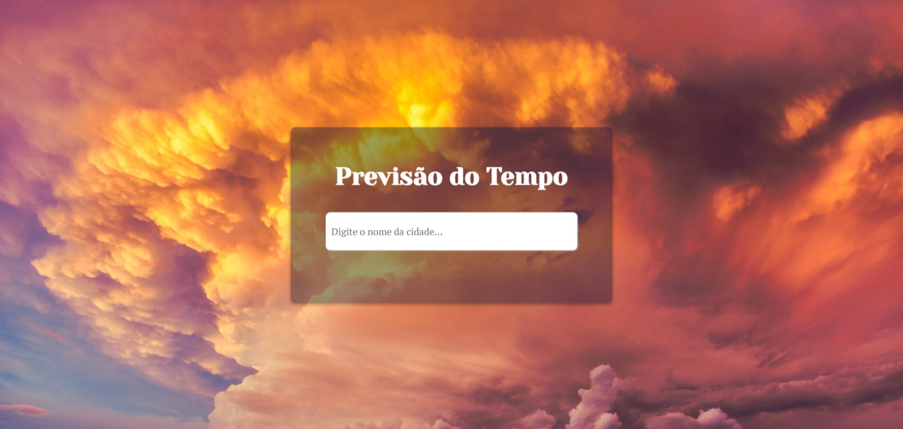
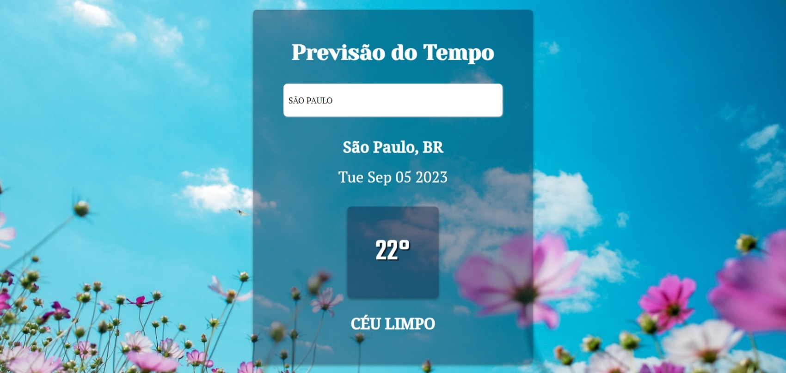
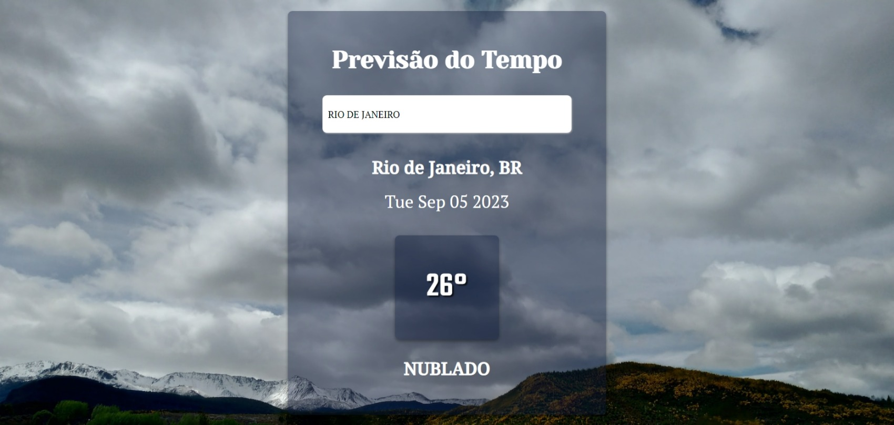
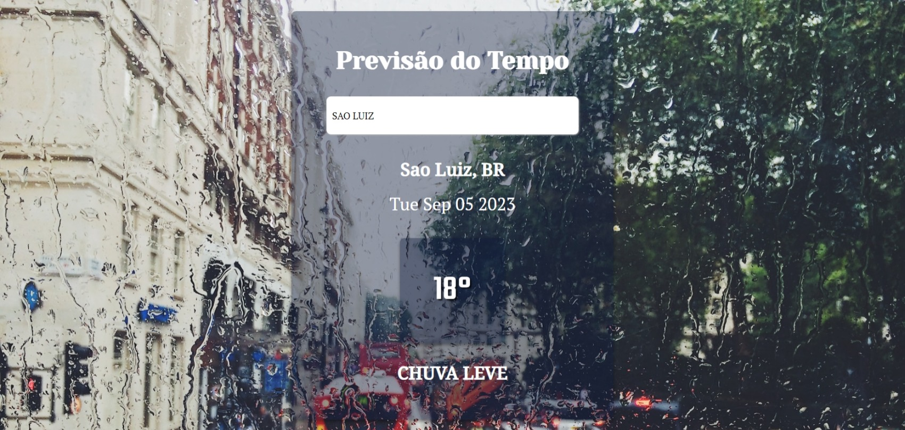
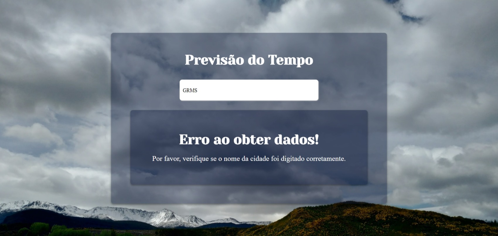

# Clima-APP

Este projeto foi criado para um projeto da faculdade, o objetivo é exibir a previsão do tempo da cidade, digitada pelo usuário, e alterar o plano de fundo de acordo com o a previsão. 

*  Clique no link para acessar a página deste projeto: <https://taisabraga.github.io/clima-app/>

## Visão Geral











## Como rodar o projeto

### Clonar o Repositório

1. Crie uma pasta para salvar o projeto

2. Dentro da pasta criada, faça um clone do repositório usando o seguinte comando:
```git clone https://github.com/TaisaBraga/clima-app.git```

### Configurar o ambiente frontend

1. Certifique- de ter o npm e o node instalado em sua máquina. Se você ainda não o tem, você pode baixar o NPM em [npm Docs](https://docs.npmjs.com/downloading-and-installing-node-js-and-npm) e o node em (https://nodejs.org/pt-br/download).
2. NPM INSTALL para baixar as dependências do projeto
3. NPM START para executar o aplicativo no modo de desenvolvimento.
4. Abra http://localhost:3000 para visualizá-lo no navegador.
